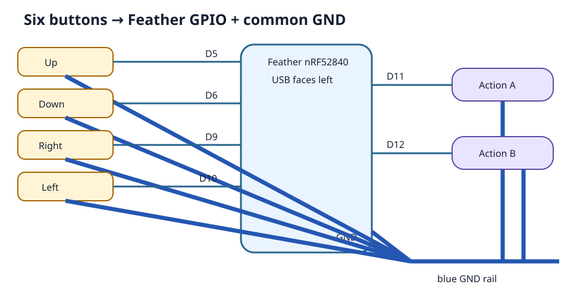

# 4. Wiring and firmware

Each controller has four normally-open directional buttons and two
normally-open action buttons. Read the complete procedure before connecting
USB power.



## Wiring map

| Control | Feather pin | Browser result |
|---|---|---|
| Up | D5 | Y negative |
| Down | D6 | Y positive |
| Right | D9 | X positive |
| Left | D10 | X negative |
| Action A | D11 | button 0 |
| Action B | D12 | button 1 |

For every button, connect one terminal to its signal pin and the other terminal
to the common blue ground rail. Bridge Feather **GND** to that rail. The red
rail is unused. USB powers the Feather; no separate power wire is needed.

With the Feather USB connector facing left, the upper breadboard positions are:

```text
9 D12 · 10 D11 · 11 D10 · 12 D9 · 13 D6 · 14 D5
```

Lower position 4 is GND and connects to the blue rail. Upper and lower rows on
opposite sides of the breadboard centre trench are not connected.

## Copy the validated firmware

The firmware is for the **Adafruit Feather nRF52840 Sense, PID 4516** and the
validated CircuitPython 10.3.0 UF2 linked in `firmware/README.md`.

1. Disconnect the button wiring from USB power.
2. Double-press Feather Reset to open the `FTHR840BOOT` drive.
3. Drag the validated CircuitPython UF2 onto that drive. It reconnects as
   `CIRCUITPY`.
4. Back up any existing files on `CIRCUITPY`.
5. Copy the **contents** of `firmware/CIRCUITPY/` to the root of the drive.
6. Safely eject and reconnect the Feather.

On Windows, do these drive-copy steps in File Explorer, not inside WSL2.

## Wire and test

1. Keep USB disconnected while wiring.
2. Label all six signal leads before connecting them.
3. Use insulated alligator/Dupont leads or solid breadboard ends. Never put
   loose stranded wire into the breadboard.
4. Insulate exposed joints and add strain relief.
5. Check continuity from each pin to its button and from all six returns to GND.
6. Confirm released signals are not shorted to GND or to one another.
7. Connect USB and open the included game starter. Test every direction and
   both action buttons separately.
8. Route wires away from the buttons, USB opening, and snap-fit edges before
   closing the case. Bond the breadboard assembly to the inside bottom surface
   with its factory adhesive.

Disconnect USB immediately if the board becomes hot, repeatedly disconnects,
or reports a short circuit.
